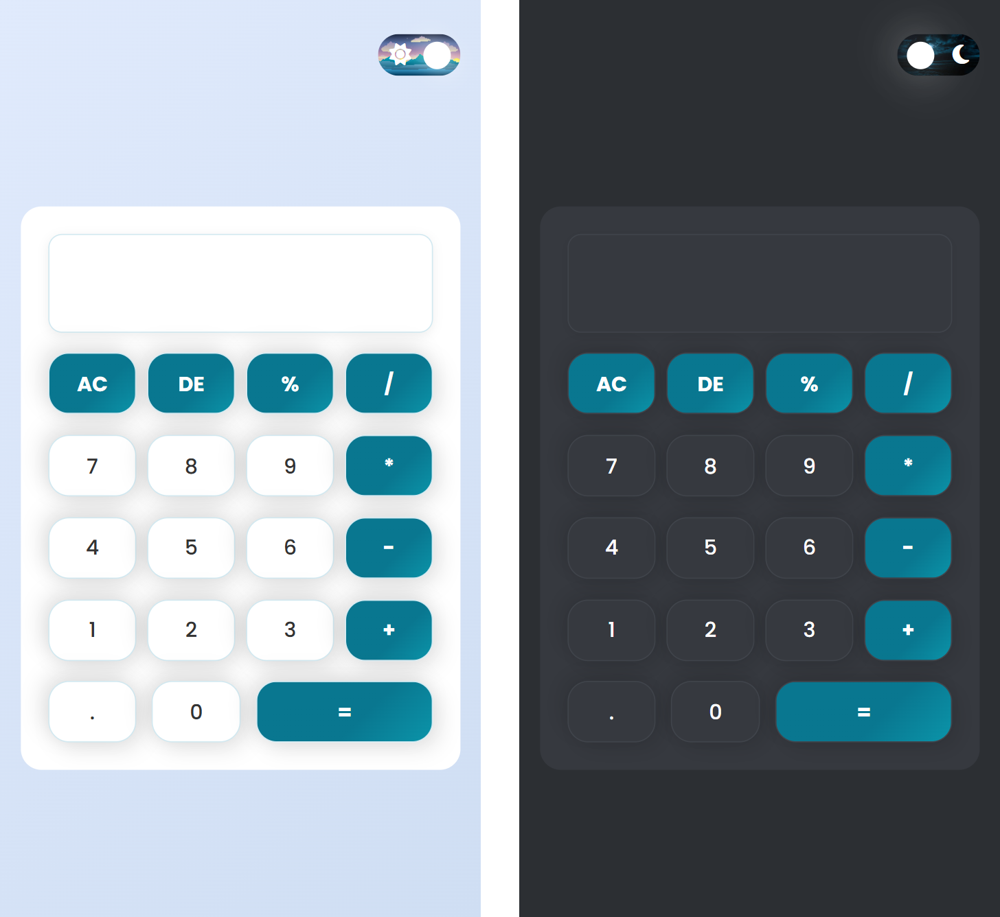

# Simple Calculator Web App

A beginner-friendly calculator project built with **HTML**, **CSS**, and **JavaScript**.

## Features
- Basic arithmetic operations: addition, subtraction, multiplication, division, percentage
- Responsive and modern UI
- Dark/Light mode toggle
- Keyboard input support
- Error handling for invalid expressions

## Screenshots

## Demo

[🔗 Live Demo]() 

## How to Use
1. **Clone or download** the project files.
2. Open `index.html` in your web browser.
3. Use the on-screen buttons or your keyboard to perform calculations.
4. Toggle between dark and light mode using the switch at the top.

## Technologies Used
- HTML5
- CSS3 (with custom properties and responsive design)
- JavaScript (DOM manipulation, event handling)

---
> This project is part of my learning journey as a beginner in web development. 